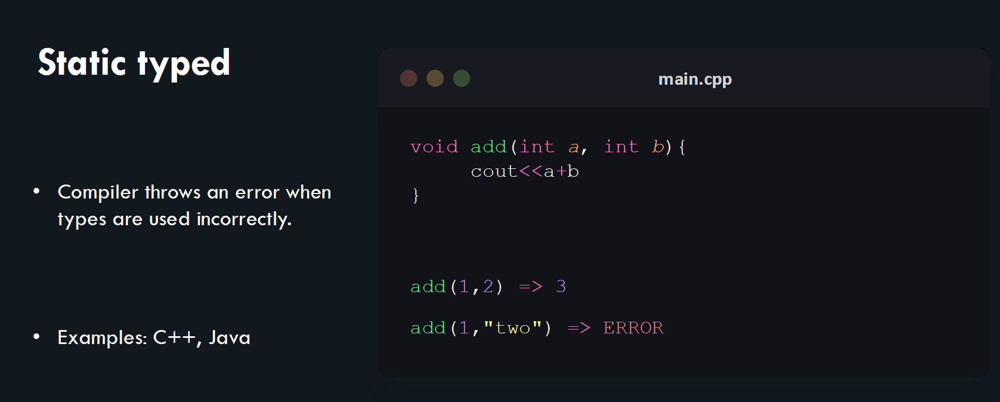

# Introduction to Golang

### Features of Golang&#x20;

Golang, or Go, is a statically typed, compiled language designed for efficiency and simplicity. Its standout features include a garbage collector, concurrency support through goroutines, and a robust standard library, making it ideal for system-level programming and large-scale applications. Go's syntax is clean and concise, encouraging clear and maintainable code. It also has a strong toolchain, which simplifies dependency management and profiling. The language's focus on performance, ease of development, and scalability makes it a popular choice for modern cloud computing and microservices architectures.

Static vs Dynamic Typed Languages&#x20;

1\) Static Typed :-\

<figure><figcaption></figcaption></figure>

Static typed advantages: • Better performance. • Bugs can often be caught by a compiler. • Better data integrity.

2\) Dynamic Typed \

<figure><figcaption></figcaption></figure>

Dynamic typed advantages: • Faster to write code. • Generally, less rigid. • Shorter learning curve.

Go has a concept of types that is either explicitly declared by a programmer or is inferred by the compiler.\
&#x20;• It's a fast, statically typed , compiled language that feels like a dynamically typed , interpreted language.\
\
